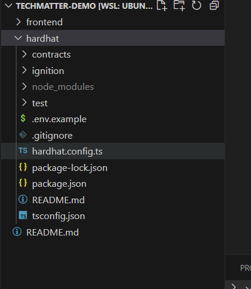

# Securing Medical Records: Deep dive into securing private file sharing via Smart Contracts

# Introduction

In this article, we will explore how we can leverage Ethereum's smart contracts and ECDH for private file sharing, using the use case of sharing medical records. This system will ensure that medical records are stored securely and can be accessed only by authorized personnel, thereby maintaining patient privacy and data security.

### Expected Learning outcomes

1. Usage of Wallet, Signer, Private and public keys.
2. Hardhat Project Setup
3. ECDH based encryption
4. Simple smart contract test cases
5. Private file sharing

## Key Concepts

### ECDH

Elliptic Curve Diffie-Hellman (ECDH) is a key exchange protocol that allows two parties, each having the other's public key, to establish a shared secret over an insecure channel. This shared secret can be used to encrypt and decrypt data, enabling secure communication.

In the context of blockchain, ECDH plays an integral role in ensuring the security and privacy of transactions. Here's how:

1. **Secure Communication**: Blockchain networks often involve communication between various nodes. ECDH can help establish secure communication channels between these nodes, even if the network itself is insecure.
2. **Public Key Cryptography**: ECDH is a form of public key cryptography, which is the foundation of how identities and transactions are verified on a blockchain. Each participant in the network has a pair of keys - a public key that is known to everyone on the network, and a private key that is kept secret. The public key is used to encrypt data, and the corresponding private key is used to decrypt it.
3. **Wallet Security**: In blockchain, your wallet (which holds your digital assets) is associated with a pair of keys. The private key is used to sign transactions and must be kept secret. However the public key can be shared with others to receive funds. ECDH allows two parties (say, a sender and a receiver) to generate a shared secret using their key pairs, without having to directly share their private keys.
4. **Privacy and Anonymity**: ECDH can also be used to enhance privacy and anonymity on the blockchain. For example, it can be used to create stealth addresses - a new public address for each transaction, which makes it difficult to link transactions to the same sender or receiver.

### Wallet, Signer, Private and public keys.

In the context of blockchain and cryptocurrencies, a wallet is a digital tool that allows users to make electronic transactions. It can be thought of as a bank account, storing your digital assets and enabling you to send and receive digital currencies.

Each crypto wallet is associated with a key pair consisting of a public key and a private key. The public key is used to create addresses where funds will be received. Just like an email address, you can share it with others to receive funds. However, unlike an email address, it is common to use a new address for each transaction to maintain privacy.

The private key, on the other hand, is like the password to your bank account. It is used to sign transactions and access the funds stored in your wallet. The private key must be kept secret, as anyone with access to it can sign transactions and essentially own the digital assets in the wallet.

A signer, in the context of blockchain, refers to the entity (usually the owner of the wallet) who signs the transactions using the private key. The signature serves as a cryptographic proof that the transaction has been authorized by the owner of the wallet. This mechanism ensures the security and integrity of transactions on the blockchain.

# Hands on Project

The project is about creating a decentralized system to handle medical records using smart contracts. This system ensures that the data (medical records) is stored securely and can only be accessed by authorized personnel (patients and doctors). Here are the key components:

1. **MedicalRecords Contract**: This is the main contract of the system. It defines the roles (Patient or Doctor) and various data structures needed to handle medical records. It includes functions to manage user roles, handle access permissions, and store public keys and medical records.
2. **User Roles**: There are two main roles defined - Patient and Doctor. A user can be assigned either of these roles. The system ensures that only users with the appropriate roles can perform certain actions. For example, only a patient can modify access to their medical records.
3. **Public Key Storage**: The contract stores the public keys of users. These keys are used to encrypt/decrypt the medical records.
4. **Medical Record Storage**: Each patient has a record that an encrypted bytes/pdf to their medical records. The patient can grant or revoke access to their medical records to/from doctors.
5. **Tests**: The tests cover the main functionalities of the contract, such as user registration, file encryption/decryption, and access control.
6. **Helper Module**: This module contains helper functions for tasks such as PDF compression/decompression, encryption/decryption, and conversion between bytes and base64.

### Step by Step Project Walkthrough

1. Clone this repo that I created : https://github.com/mueed98/private-file-sharing-using-smart-contracts
2. Change directory to hardhat and open terminal
Project Tree is something like this



1. Install node modules using the command `npm i`.
2. Before testing, we need to set up environment variables if we want to deploy the smart contract.
3. Based on .env.example, create a `.env` file. - You can get ARB_SEPOLIA RPC from [https://www.alchemy.com/](https://www.alchemy.com/). - Create a Metamask account and paste its private key in the .env file. - Now, you need some testnet ETH in your wallet address (the same address from which you pasted your private key in the .env file). - To get some testnet ETH, go to [https://www.alchemy.com/faucets/arbitrum-sepolia](https://www.alchemy.com/faucets/arbitrum-sepolia) and get testnet ETH in your wallet address.
Complete the .env variables as follows:


1. Try the command `npx hardhat test` in the terminal.
If you see an output similar to this, it means your project is working fine. 
    1. Remember, `npx hardhat test` first compiles the smart contracts, then runs the test cases on them.


### Smart Contract Walkthrough

You can find the smart contract here : 


There are two most important functions in the smart contract 


- When a user wants to onboard, they use the ModifyUser function. It's a write function, meaning it will change the contract state. A user will provide their public key and the role they want to assume.
Remember, one user/wallet/address can only have one role.
- A patient can grant or revoke access to a particular doctor. For this, they use the modifyAccess function.

### Test file Walkthrough

Test file is here : 


Now lets go through it step by step 

### Test Start

Start of file looks like this


The code is importing libraries necessary to interact with the hardhat test environment.
Note the fourth import - it's importing v5 of ethers.
If you look at the package.json file, you'll see that hardhat provides ethers v6, but we're also adding ethers v5 as v5ethers. Essentially, we'll be using two versions of ethers.
The reason for this is that ethers v6 has introduced breaking changes, particularly in relation to encryption-related functions. To ensure better compatibility with other components (for example, an older frontend that uses v5 ethers or a server that uses older ethers), we're using v5 ethers here.

After all the imports, we describe what our test file is, load our smart contract into a CONTRACT variable from the hardhat test environment, and load the signers into PATIENT and DOCTOR.
Remember: If you run `npx hardhat node` in a terminal, hardhat will start its own local chain and you'll see hardhat printing 20 accounts with their private keys.


In our test file, we are loading those exact same signers/accounts. Since we also know the private keys of those signers, we are loading them as well.
In a production environment using frontend, the user can input their own private key if needed.

For now, we don't need `npx hardhat node`, so close the terminal.

We are treating signer 1 as PATIENT and signer 2 as DOCTOR. Signer 0 is the address/wallet that is deploying the smart contract on the hardhat test environment.
Now, a signer is an instance of a wallet connected to a provider.
In our case, the provider is the hardhat test chain. In production, it is usually an RPC connecting to a blockchain, for example, Ethereum.

This signer (since it's a wallet), has a public key and can sign transactions using its private key.

### Test Case 1


In this step, we will register the PATIENT signer as a patient in the system.
Since the signer instance or even Metamask does not provide the public key out of the box, we need to calculate it. This is done by giving Metamask/signer a message to sign, and then we decrypt that message to obtain the public key.

If you see 

```
		await CONTRACT.connect(PATIENT).modifyUser(
			v5ethers.utils.arrayify(publicKey),
			1
		);
```

We are connecting the PATIENT to the contract (since we want the patient to sign the transaction) and then saving the data to the smart contract. '1' represents the PATIENT in the ROLE enum within the smart contract. Refer to the contract code for further details.

```tsx
		expect(await CONTRACT.userRoles(PATIENT.address)).to.equal(1);

		const _key = await CONTRACT.connect(PATIENT).publicKeys(PATIENT.address);
		expect(v5ethers.utils.hexlify(_key)).to.equal(publicKey);
```

Here we are making sure contract has correct data now. expect is a hardhat test feature available through chai library

### Test Case 2

Similar to test case 1, we are now doing the same thing to register DOCTOR signer as doctor in our system 


### Test Case 3


This test case is primarily to verify if our encryption and decryption are functioning correctly before we actually save anything to the contract.
The comments already explain what is happening.
Refer to the helper.ts file to see how the cryptoJS library is performing encryption and decryption using the shared secret generated by ECDH.

### Test case 4 and 5


These test cases simulate a common scenario in the contract, where a patient encrypts a file and saves it on the contract, and then a doctor retrieves and decrypts the file. The tests ensure that the encryption, saving, retrieval, and decryption processes all work as expected

### Last test case


Here we are removing the doctor accesss to file 

### Frontend

Switch to the frontend directory. Install node modules using `yarn`, then run `yarn start`.
You can test everything that was done on hardhat on this frontend and also learn about Metamask connection, network switching, message signing using metamask etc.
But remember to get some test ETH from the Alchemy Arb Sepholia faucet.

# CAUTION

- For the sake of simplicity for end users, this contract is straightforward without any major optimizations.
- This is a test project and has not been tested for security vulnerabilities.
- The test cases do not ensure full test coverage of the smart contract.
- The smart contract is not optimized for file sharing, so it should not be used for production.

# Potential Improvments

- Instead of saving the encrypted bytes of a PDF into the smart contract, save it on IPFS and store the string IPFS link in the smart contract. When it's time to decrypt, simply read the string link, access the data on that link, and decrypt it.
- Storing files on the contract itself is very expensive. Therefore, saving only the IPFS link or data file hash is a more optimized approach.
- File deletion and the doctor’s patient list can be significantly improved using mappings and assembly code.

## The End

For question and quries you can contact me at : 

[https://www.linkedin.com/in/mueed98/](https://www.linkedin.com/in/mueed98/)